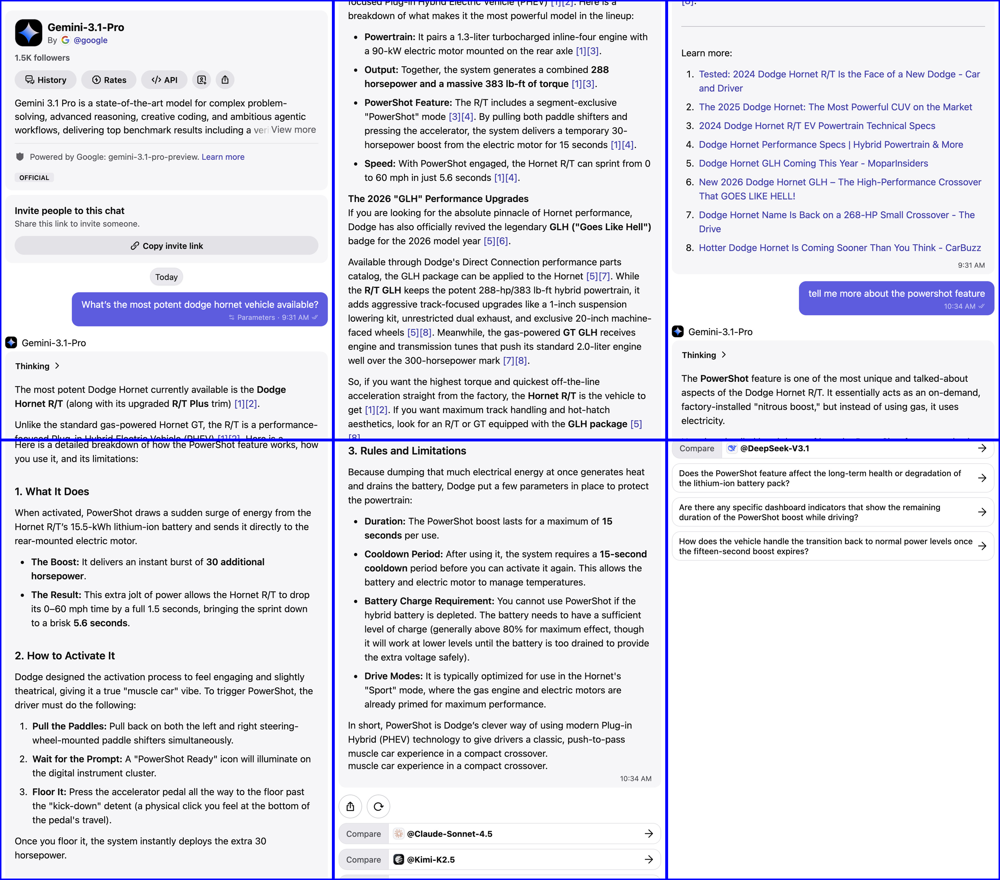

# imgsplit

Split a tall JPEG, PNG, or PDF into page-sized slices ready for printing or embedding in A4 or Letter documents.

Scrolling screenshots and other vertically-stitched images are typically too tall to fit on a single page. `imgsplit` scales the image to fill the page width and cuts it into uniform slices, one per page.

| Original tall image | Split into printable PDF pages |
|---|---|
|  |  |

## Installation

```bash
curl -fsSL https://raw.githubusercontent.com/rsnemmen/imgsplit/main/install.sh | bash
```

Installs into `~/.local/share/imgsplit` with a wrapper at `~/.local/bin/imgsplit`. Requires Python 3.10+.

Re-run the same command to upgrade.

Uninstall: `rm -rf ~/.local/share/imgsplit ~/.local/bin/imgsplit`

## Usage

```
imgsplit [options] input
```

### Arguments

| Argument | Default | Description |
|---|---|---|
| `input` | — | Input JPEG, PNG, or PDF file |
| `--format {A4,Letter}` | `A4` | Page format |
| `--dpi DPI` | `150` | Output resolution in DPI |
| `--margin MM` | `10` | Margin on each side in mm |
| `--output DIR` | input file's directory | Directory to write output files |
| `--prefix NAME` | input filename stem | Prefix for output filenames |
| `--images-only` | off | Save numbered PNGs instead of a PDF |

### Output

By default a single multi-page PDF is produced and the intermediate PNGs are removed:

```
{prefix}.pdf
```

With `--images-only`, numbered PNGs are saved instead and no PDF is created:

```
{prefix}_001.png
{prefix}_002.png
...
```

The last page is padded with white if the image does not fill it completely.

## Examples

```bash
# Default: A4, 150 DPI, 10 mm margins
imgsplit screenshot.png

# Letter format at 300 DPI
imgsplit screenshot.png --format Letter --dpi 300

# No margins
imgsplit screenshot.png --margin 0

# Write pages to a subdirectory with a custom prefix
imgsplit screenshot.png --output ./pages --prefix slide

# Keep individual PNGs instead of producing a PDF
imgsplit screenshot.png --images-only
```

### Sample output

```
Input:          screenshot.png  (1560 × 19842 px)
Page format:    A4, 150 DPI, 10.0 mm margin
Printable area: 1122 × 1636 px
Output:         ./
  [1/9] screenshot_001.png
  ...
  [9/9] screenshot_009.png
PDF:            screenshot.pdf

Done — 9-page PDF written.
```

## How it works

1. The image is scaled so its width fills the printable area (page width minus margins).
2. The scaled image is sliced into vertical strips, each one page tall.
3. Transparent images (RGBA/PNG with alpha) are composited onto a white background before slicing.
4. PDF inputs are rendered to a bitmap at the requested DPI; multi-page PDFs are stacked vertically into one tall image before slicing.

## Page dimensions reference

| Format | Size | Printable area at 150 DPI, 10 mm margin |
|---|---|---|
| A4 | 210 × 297 mm | 1122 × 1636 px |
| Letter | 215.9 × 279.4 mm | 1146 × 1476 px |

At 300 DPI the pixel counts double in each dimension.
